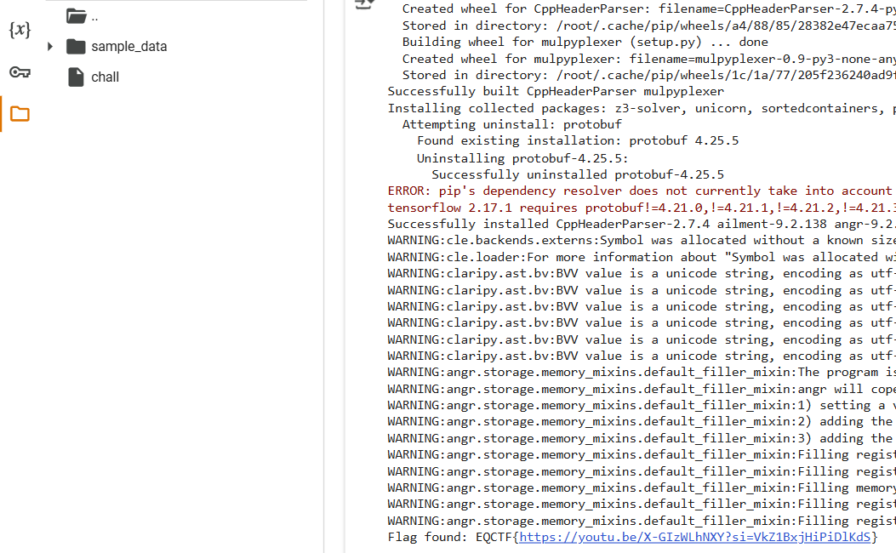

 
---
### Goals
1. Check file information using checksec
2. Decompilation using ghidra, check the flagchecker flow
3. Deploy angr script, perform symbolic analysis
_References:_
https://shinmao.github.io/posts/2022/02/bp1/
https://github.com/jakespringer/angr_ctf
---
1. Using checksec, we realised the file is dynamcally linked, stripped
 
2. Decompile with ghidra, since it's stripped, we have to find the main entry from entry function
 
3. Try to rename the variables, functions, for ease of analysis
 
From this point, we could know that:
- The program proceed if flag length == 0x37 (55 characters), 
- It go through complex transformation, lastly doing flagcheck and tell if the flag provide from user input is correct
- Well, we are not going to reverse and go through these complex transformations.
- Instead, we will deploy angr script, automate this process

4. I deployed the angr script on google colab
 
```python
!pip install angr

import angr
import claripy
  
# Define binary path and parameters
input_file_path = './chall'
flag_length = 55
known_string = 'EQCTF{'
FIND_ADDR = 0x4016e4
AVOID_ADDR = [0x4016fa, 0x40159f]
START_ADDR = 0x40158d

# Load the binary
proj = angr.Project(input_file_path, auto_load_libs=False, main_opts={'base_addr': 0x400000})
  
# Create symbolic characters for the flag
known_chars = [claripy.BVV((known_string[i])) for i in range(len(known_string))]
flag_chars = [claripy.BVS(f"flag_{i}", 8) for i in range(flag_length - len(known_string))]
flag = claripy.Concat(*known_chars + flag_chars)

# Create a blank state at the start address
state = proj.factory.blank_state(addr=START_ADDR)
state.options.add(angr.options.LAZY_SOLVES)
state.options.add(angr.options.UNICORN)
  
# Define the address of the local variable `local_58` (e.g., `[RBP - 0x50]`)
# Assume RBP is initialized to some stack base (common for blank_state)
stack_base = state.regs.rbp
local_58_address = stack_base - 0x50  # Offset to local variable `local_58`
  
# Store the symbolic flag into `local_58`
state.memory.store(local_58_address, flag)

# Pass the address of `local_58` in RDI (used by __isoc23_scanf)
state.regs.rdi = local_58_address

# Add constraints to ensure flag is printable (ASCII range 0x20 to 0x7e)
for k in flag_chars:
    state.solver.add(k < 0x7f)  # Less than 0x7f (127)
    state.solver.add(k > 0x20)  # Greater than 0x20 (32)

# Create a simulation manager
sim_manager = proj.factory.simulation_manager(state)

# Explore paths to find the target address while avoiding bad paths
sim_manager.explore(find=FIND_ADDR, avoid=AVOID_ADDR)

# Check if a solution was found
if len(sim_manager.found) > 0:
    # Evaluate the symbolic flag to retrieve its value
    solution = sim_manager.found[0].solver.eval(flag, cast_to=bytes)
    print(f"Flag found: {solution.decode()}")
else:
    print("No solution found.")
```
To understand how this script works in details, do check out the references provided, and follow the tutorials.
The scripting is hard, it just follow a strict template.
However, there are few points worth mentioning, 
- the start_addr, should be placed after scanf CALL instruction, better if placed at where complex transformation start
- symbolic stack approach is an important point, specifically for this challenge where you can't just use a universal angr template
- blank_state should be used instead of entry_state because strlen is called before scanf, if you define the sim manager with entry state, it will waste extra resources going through strlen library call. Within all libc library call, there are mutex locks which angr cant deal with, which is why you need to hook the function and simulate user input with symbolic memory
- find_addr, is the desired memory location where the instance of "Correct" is reached
- avoid_addr are the memory location to avoid such as "Wrong"

### Final Result
---
 


