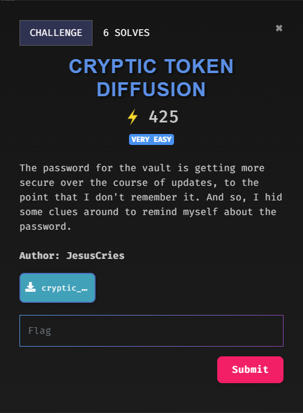

 

---
### Goals
1. Perform binary diffing
2. Match index number to correspond characters
3. Rearrange the character in ascending order according to their index number
_Tools required: vbindiff_
---
1. Viewing the files, there are two versions of application. Thus, we try to compare the difference between versions.
 
```bash
vbindiff vault-v1.0.0.elf vault-1.2.1.elf
```

2. Observe the pattern, we realised that there are two parts showing difference in binaries:
	- vault-v1.0.0 acts as the index number, corresponds to the characters in vault-v1.2.1
_Part 1_
 
_Part 2_
 
- List out all the correspondence, sort them in ascending order, turn to ASCII and print it out
```python
v1p1 = [12, 28, 0, 23, 15, 21, 10, 4, 27, 5, 26, 8, 17, 3, 18, 25]
v1p2 = [9, 13, 7, 24, 6, 2, 1, 11, 14, 22, 29, 16, 19, 20]

v2p1 = [0x37, 0x67, 0x45, 0x31, 0x62, 0x5f, 0x30, 0x46, 0x6e, 0x7b, 0x31, 0x74, 0x6e, 0x54, 0x34, 0x66]
v2p2 = [0x72, 0x30, 0x6E, 0x66, 0x31, 0x43, 0x51, 0x5F, 0x5F, 0x64, 0x7D, 0x31, 0x72, 0x79]

v1 = v1p1 + v1p2
v2 = v2p1 + v2p2

pairs = sorted(zip(v1, v2))

sorted_ascii = ''.join(chr(value) for _, value in pairs)

print(sorted_ascii)
```
### Final Result
---
 
