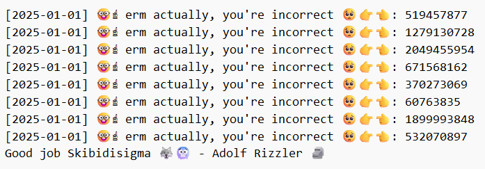

  
 
---
### Goals
1. Deobfuscate the C code, you may choose not to as it just work
2. Observe the log, figure out how the flag might relate to the timestamp
---
1. Opening the file, you will see obfuscated C code
```cpp
#define rn ;
#define finna =
#define cap !=
#define mf *
#define bouta &
#define ongod ++
#define sheesh <
#define fr <<
#define bet if
#define chief main
#define yikes break
#define deadass return
#define skibidi {
#define tho }
#define bussin cout
#define huh true
#define lit double

#include <iostream>
#include <fstream>
#include <iomanip>
#include <openssl/sha.h>


using namespace std rn

unsigned int seed() skibidi
    deadass static_cast<unsigned int>(time(nullptr)) rn
tho

string getHash(lit value) skibidi
    ostringstream oss rn
    oss fr setprecision(17) fr value rn
    string text finna oss.str() rn
    unsigned char hash[SHA256_DIGEST_LENGTH] rn
    SHA256(reinterpret_cast<const unsigned char mf>(text.c_str()), text.size(), hash) rn
    ostringstream result rn
    for (int i finna 0 rn i sheesh SHA256_DIGEST_LENGTH rn i ongod) {
        result fr hex fr setw(2) fr setfill('0') fr static_cast<int>(hash[i]) rn
    tho
    deadass result.str() rn
tho


int chief() skibidi
    while (huh) skibidi
        unsigned int s finna seed() rn
        srand(s) rn
        int x finna rand() rn

        string flag finna getHash(x) rn

        bet (flag.find("a9ba358e") cap string::npos) {  
            ofstream outfile("./flag") rn
            bet (outfile.is_open()) {
                outfile fr "EQCTF{" fr flag fr "tho" rn
                outfile.close() rn
            tho
            yikes rn
        tho
  
        time_t now finna time(0) rn
        tm mf ltm finna localtime(bouta now) rn


        bussin fr "[" fr 1900 + ltm->tm_year fr "-" rn
        bussin fr 1 + ltm->tm_mon fr "-" rn
        bussin fr ltm->tm_mday fr "] " rn
        bussin fr "🤓☝️ erm actually, you're incorrect 🥺👉👈: " fr x fr endl rn
    tho
    bussin fr "Good job Skibidisigma 🐺🥶 - Adolf Rizzler 🗿" fr endl rn

    deadass 0 rn
tho
```
Just replace the obfuscated part with its actual symbol as shown in define list, to ease our debugging process.

2. After debobfuscation,
```cpp
#include <iostream>
#include <fstream>
#include <iomanip>
#include <openssl/sha.h>
  
using namespace std;
  
unsigned int seed()
{
    return static_cast<unsigned int>(time(nullptr));
}

string getHash(double value)
{
    ostringstream oss;
    oss << setprecision(17) << value;
    string text = oss.str();
  
    unsigned char hash[SHA256_DIGEST_LENGTH];
    SHA256(reinterpret_cast<const unsigned char *>(text.c_str()), text.size(), hash);

    ostringstream result;
    for (int i = 0; i < SHA256_DIGEST_LENGTH; i++)
    {
        result << hex << setw(2) << setfill('0') << static_cast<int>(hash[i]);
    }
    return result.str();
}


int main()
{
    while (true)
    {
        unsigned int s = seed();
        srand(s);
        int x = rand();

        string flag = getHash(x);

        if (flag.find("a9ba358e") != string::npos)
        {
            ofstream outfile("./flag");
            if (outfile.is_open())
            {
                outfile << "EQCTF{" << flag << "}";
                outfile.close();
            }
            break;
        }

        time_t now = time(0);
        tm *ltm = localtime(&now);
  
        cout << "[" << 1900 + ltm->tm_year << "-";
        cout << 1 + ltm->tm_mon << "-";
        cout << ltm->tm_mday << "] ";
        cout << "🤓☝️ erm actually, you're incorrect 🥺👉👈: " << x << endl;
    }
    cout << "Good job Skibidisigma 🐺🥶 - Adolf Rizzler 🗿" << x << endl;

    return 0;
}
```

3. Observing the logfile, 
 
We should focus that flag is paired up on \[2025-01-01], so we should patch our c code to run on that time stamp, and which we just need to fix the seed() function
Part that affect:
```cpp
unsigned int s = seed();
srand(s);
int x = rand();
```
Patched seed() function:
```cpp
// Brute-force timestamp around 2025-01-01
unsigned int seed() {
    static time_t test_time = 1735689600;  // 2025-01-01 00:00:00 UTC
    if (test_time <= 1735775999) {  // 2025-01-01 23:59:59 UTC
        return static_cast<unsigned int>(test_time++);
    }
    return static_cast<unsigned int>(time(nullptr)); // Fallback to current time
}
// -------------------------------------------
// You may also add the line for Found correct seed: to indicate that you found correct seed
if (flag.find("a9ba358e") != string::npos) { 
	ofstream outfile("./flag"); 
	if (outfile.is_open()) { 
		outfile << "EQCTF{" << flag << "}"; 
		outfile.close(); } 
		cout << "Found correct seed: " << s << endl; 
		break; 
	}
...
...
```

4. Due to the usage of openssl/sha.h, we should compile our C++ file as below
```bash
g++ -o gen_z chall.cpp -lssl -lcrypto
```
5. Execute the file
```bash
./gen_z
```

### Final result
---
 
And flag file is generated:
 