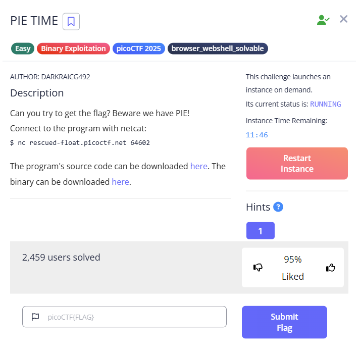
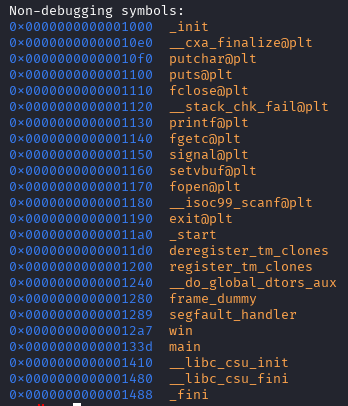
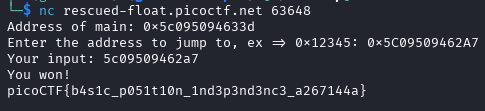

---
### Goals
1. Call the win() function
---
### Solution:

1. Disassemble with gdb  
  

2. Observe the difference in address between main function and win function
The difference is 0x96, thus, to call the function's address, it must always be `main()` - `0x96`

### Final Result
---
Launch the challenge  
  
**Flag:** `picoCTF{b4s1c_p051t10n_1nd3p3nd3nc3_a267144a}`
