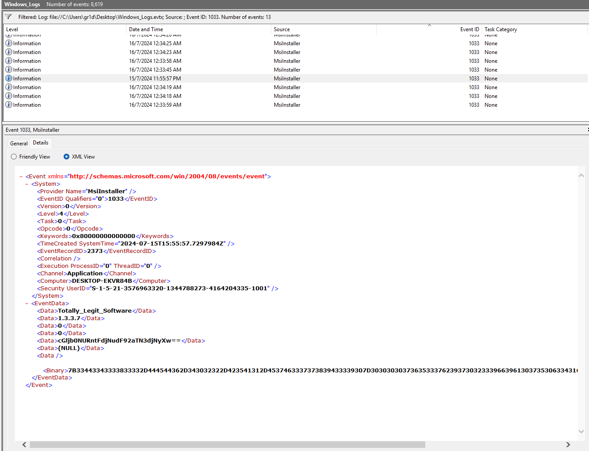
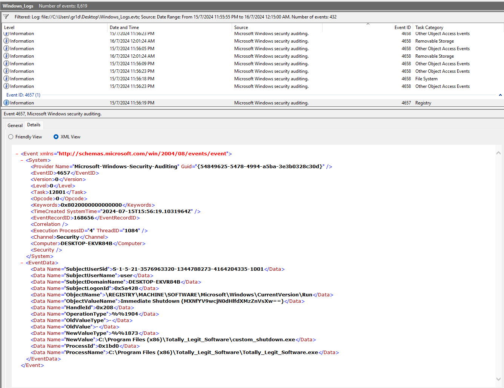
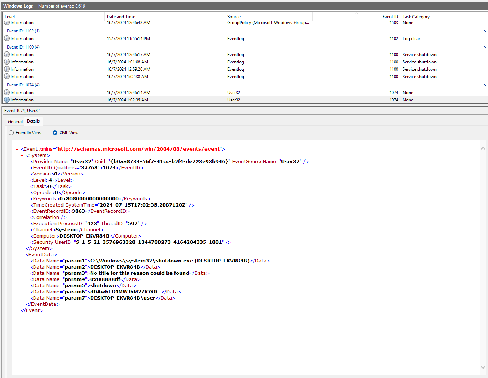

---
### Goals
1. Lookup 1033 Event, msi package install event id
2. Filter with date and time, look for suspicious event after 1033 happen within a short time range, about 20 minutes, found
3. "EVERY TIME" <---(from question), so clear date and time filter, find with keyword "shutdown.exe" throughout whole event log
---
### Solution:

Part 1:  
  
**Base64:** `cGljb0NURntFdjNudF92aTN3djNyXw==`
**Flag 1:** `picoCTF{Ev3nt_vi3wv3r_`

Part 2:  

**Base64:** `MXNfYV9wcjN0dHlfdXMzZnVsXw==`
**Flag 2:** `1s_a_pr3tty_us3ful_`

Part 3:  
  
**Base64:** `dDAwbF84MWJhM2ZlOX0=`
**Flag 3:** `t00l_81ba3fe9}`

### Final Result
---
**Flag:** `picoCTF{Ev3nt_vi3wv3r_1s_a_pr3tty_us3ful_t00l_81ba3fe9}`
