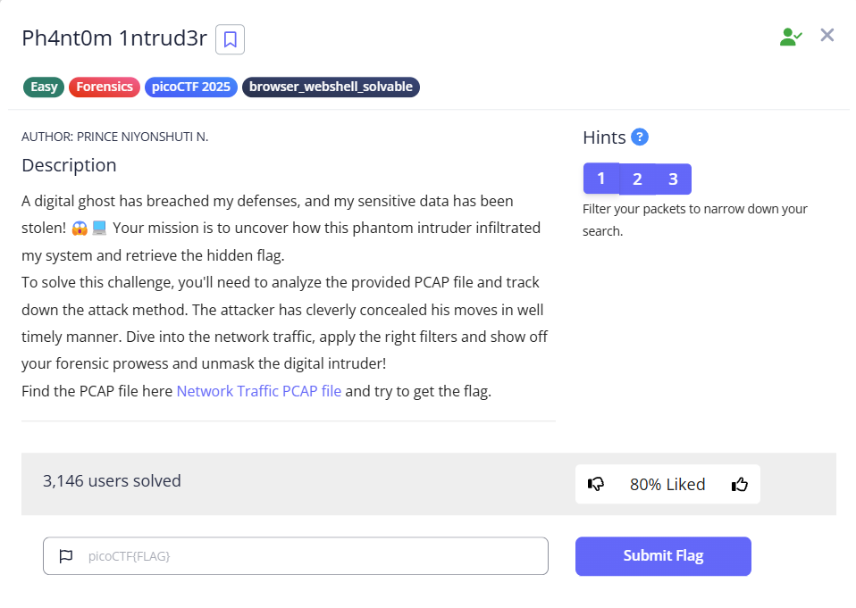

  
---
### Goals
1. Sort the time, since the reference times are messed up
2. Decode flag encoded in base64 in a series of consecutive packets
---
### Solution:

  

### Final Result
---
**Flag:** `picoCTF{1t_w4snt_th4t_34sy_tbh_4r_e5e8c78d}`
