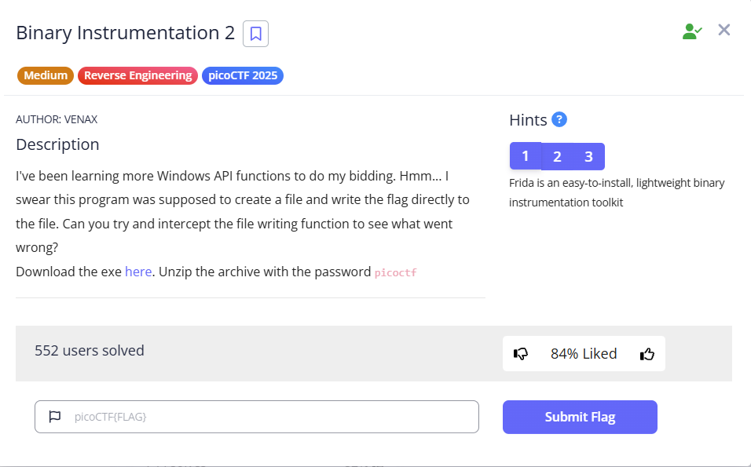
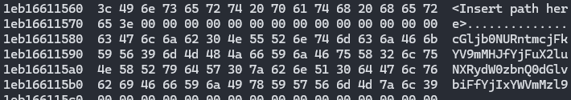

  
---
### Goals
1. Disassemble with ghidra, look for suspicious function
2. Hook with frida
---
### Solution:
1. Deploy the script that hook suspicious function at `0x1dc0`
```js
// Get the module base address for bininst2.exe
var moduleBase = Module.findBaseAddress("bininst2.exe");
console.log("Module base address: " + moduleBase);

// Calculate the target function address using a known offset (update this offset as needed)
var funOffset = 0x1dc0; // Adjust this based on your analysis
var targetFunction = moduleBase.add(funOffset);
console.log("Hooking function at: " + targetFunction);

// Hook the target function (FUN_140001dc0)
Interceptor.attach(targetFunction, {
    onEnter: function(args) {
        // Assume:
        //   args[0] is a pointer to the flag data
        //   args[1] is the length of the flag data
        var length = args[1].toInt32();
        try {
            // Try to read the flag data as a UTF-8 string
            var flagData = Memory.readUtf8String(args[0], length);
            console.log("Flag data intercepted (utf8): " + flagData);
        } catch (err) {
            console.log("Error reading flag data as UTF-8: " + err);
            // If reading as a string fails, dump the raw bytes
            console.log("Flag data intercepted (raw):\n" + hexdump(args[0], { length: length, header: true, ansi: false }));
        }
    },
    onLeave: function(retval) {
        console.log("FUN_140001dc0 returned: " + retval);
    }
});
```
2. Run the script, then find for the flag
```bash
frida -l <script>.js -f ./bininst2.exe
```

### Final Result
---
Base64 Encoded Flag:  
  
**Flag:** `picoCTF{fr1da_f0r_b1n_in5trum3nt4tion!_b21aef39}`
