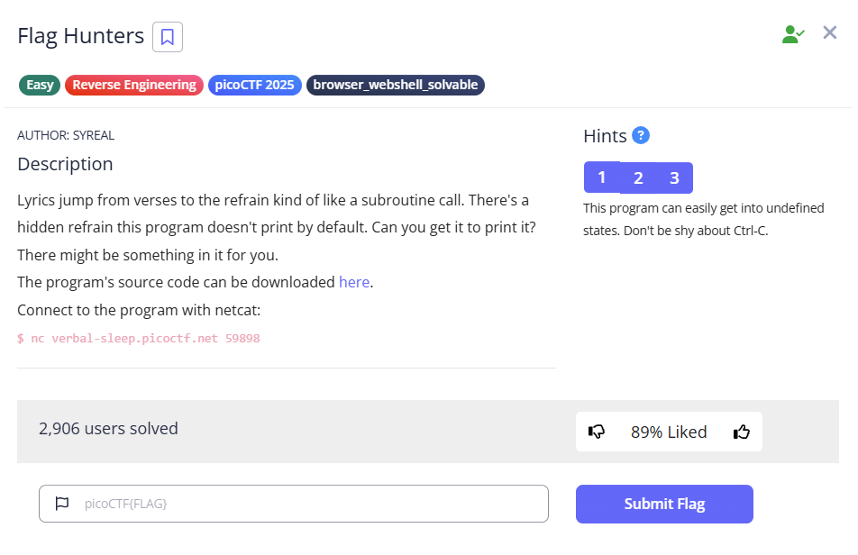

  
---
### Goals
When the program starts, the lip is set to the line [VERSE], to retrieve the secret_intro, we need to alter the program so the lip variable set to the line of flag
```
Pico warriors rising, puzzles laid bare,
Solving each challenge with precision and flair.
With unity and skill, flags we deliver,
The ether’s ours to conquer, '''\
+ flag + '\n'
```
as shown, flag is at line 4

so passing index 0 to 3 will works, printing at the start of the lines at most line 4, index 3

**Payload:** `<any_text>;RETURN <0 to 3>   (This is not injection)`
### Final Result
---
**Flag:** `picoCTF{70637h3r_f0r3v3r_c659e814}`
