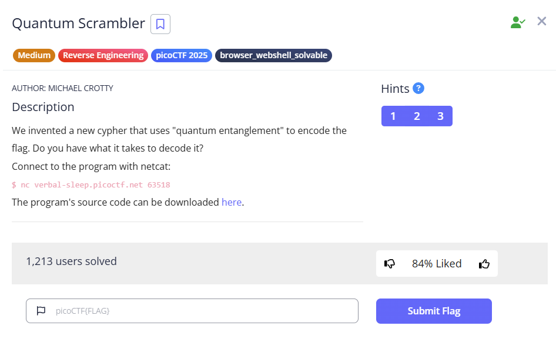

  
---
### Goals
1. Decrypt the encryption and retrieve the flag
2. Dissect the elements, and observe the scramble
3. Found final payload, decrypt with reversed scrambler
---
### Solution:
Reversed scrambler:
```python
import ast

def flatten(lst):
    flat = []
    for item in lst:
        if isinstance(item, list):
            flat.extend(flatten(item))
        else:
            flat.append(item)
    return flat

def unscramble(cypher):
    print("Outer list elements:")
    for index, element in enumerate(cypher):
        print(f"Element {index}: {element}")
    print("-" * 40)
    
    flat_list = flatten(cypher)
    
    hex_strings = [s for s in flat_list if isinstance(s, str) and s.startswith("0x")]
    
    flag_chars = [chr(int(h, 16)) for h in hex_strings]
    flag = ''.join(flag_chars)
    return flag

def main():
    input_file = 'output.txt'
    
    try:
        with open(input_file, 'r') as f:
            cipher_text = f.read()
    except Exception as e:
        print(f"Error reading file {input_file}: {e}")
        return
    
    try:
        cypher = ast.literal_eval(cipher_text)
    except Exception as e:
        print("Error interpreting cipher text:", e)
        return
    
    flag = unscramble(cypher)
    print("Recovered flag:", flag)

if __name__ == '__main__':
    main()
``` 
**Final payload:** `[['0x70'],['0x69'],['0x63'],['0x6f'],['0x43'],['0x54'],['0x46'],['0x7b'],['0x70'],['0x79'],['0x74'],['0x68'],['0x6f'],['0x6e'],['0x5f'],['0x69'],['0x73'],['0x5f'],['0x77'],['0x65'],['0x69'],['0x72'],['0x64'],['0x65'],['0x66'],['0x38'],['0x65'],['0x61'],['0x30'],['0x63'],['0x66'],['0x7d']]`  
_Save this as output.txt_

### Final Result
---
**Flag:** `picoCTF{python_is_weirdef8ea0cf}`
