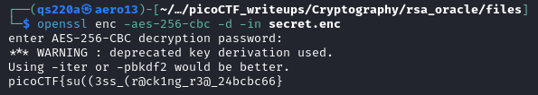

# picoCTF 2024: rsa_oracle
---
Tags: Cryptography


### Description
Decrypt the password and use it to decrypt the message. ***The oracle can decrypt anything except the password.***

#### Hints
1. Cryptography Threat models: chosen plaintext attack
2. OpenSSL can be used to decrypt the message. e.g. *openssl enc aes-256-cbc -d ...*
3. The key to getting the flag is by sending a custom message to the server by taking advantage of the RSA encryption algorithm.
4. Minimum requirements for a useful cryptosystem is CPA security.
---
#### Goals
1. Perform CCA(chosen ciphertext attack) on RSA(asymmetric encryption) to extract password(ciphertext given) from password.enc
```
2575135950983117315234568522857995277662113128076071837763492069763989760018604733813265929772245292223046288098298720343542517375538185662305577375746934
```

2. Use the extracted password to decrypt secret.enc using openssl tool under AES(symmetric encryption)

Followed this process: [https://crypto.stackexchange.com/questions/2323/how-does-a-chosen-plaintext-attack-on-rsa-work/2331#2331](https://crypto.stackexchange.com/questions/2323/how-does-a-chosen-plaintext-attack-on-rsa-work/2331#2331)

---
Note: 
- The hint given is cpa attack, but cca is implemented.
- This is a hybrid encryption question.
- To solve this question, we should know RSA multiplicative property, which are from the encryption and decryption formula:
$$C≡M^e mod (n)$$
$$M≡C^d mod (n)$$
- One need to understand how the congruence work between the basic modular arithmetic.
- We focus on multiplicative properties of the modular arithmetic to exploit RSA vulnerability
- Other than that, the rest is just about applying tools.
---
Script:
```
from pwn import *

context.log_level='critical'
p = remote("titan.picoctf.net", 52589)

p.recvuntil(b"decrypt.")

with open("password.enc") as file:
    c = int(file.read())

p.sendline(b"E")
p.recvuntil(b"keysize): ")
p.sendline(b"\x02")
p.recvuntil(b"mod n) ")

c_a = int(p.recvline())

p.sendline(b"D")
p.recvuntil(b"decrypt: ")
p.sendline(str(c_a*c).encode())
p.recvuntil(b"mod n): ")

password = int(p.recvline(), 16) // 2
password = password.to_bytes(len(str(password))-7, "big").decode("utf-8")

print("Password:", password)
```
The attack starts by reading `password.enc` and storing the encrypted password(ciphertext) as `c`. The program then encrypts the value `2`, stores it as `c_a`, and exploits RSA's **multiplicative property** by multiplying `c` and `c_a` modulo *`N`*. This manipulated ciphertext is sent to the decryption oracle, which returns the result in hexadecimal.

The result is converted to an integer, divided by `2` to recover the original password, then decoded into bytes for use. Finally, the password is used to decrypt the AES-encrypted file in order to retrieve the flag.

Notes:
- One might think that why not just reverse inputting the ciphertext given and we could get the plaintext? The reason is ***The oracle can decrypt anything except the password(ciphertext).*** Thus, we need to figure out a way to exploit it.
- 2 is just a chosen plaintext, it can be any value, just then it has to suit in the mathematical consideration
- We should have no concerns toward value of e, d, n or whatsover, we communicate with server, we are accessing its encryption/decrytion system, they are going to do the encryption work, merely we can't input the original ciphertext, which was disallowed, we have to transit it to another form to solve it, hence CCA attack is implemented
- It's actually not necessary to have the script to solve this challenge, the objective of this script is not to automate our attack but to perform and handle a large constraint numbers calculations

Chosen Ciphertext Attack (CCA) terminology, question-wise:
  

---
### Steps
Extract the plaintext from ciphertext in password.enc with pwntools.py(the script)


After obtaining the password from first phase, RSA-CCA, proceed with AES-decryption(symmetric encryption), running this command, targeting the secret.enc file:
```
openssl enc -aes-256-cbc -d -in secret.enc
```
  

Flag obtained:  

