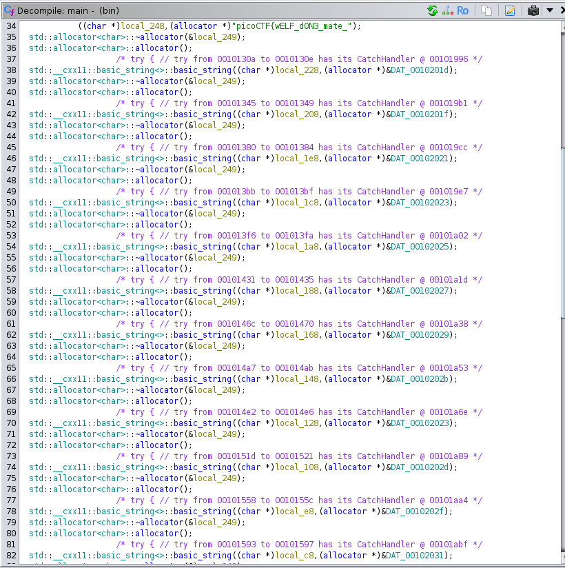

# picoCTF 2024: FactCheck
---
Tags: Reverse Engineering


### Description
This binary is putting together some important piece of information... Can you uncover that information? Examine this [file](https://artifacts.picoctf.net/c_titan/188/bin). Do you understand its inner workings?

---
#### Goals
1. Use ghidra to decompile the binary file given
2. Analyse the code structure
3. Obtain the first half flag which is interpreted in text
4. Analyse through the code and memory allocations, control statement, and determine the rest of the string appended.
---
We obtained the first half flag somewhere in the main function  
  

```
  pcVar2 = (char *)std::__cxx11::basic_string<>::operator[]((ulong)local_208);
  if (*pcVar2 < 'B') {
    std::__cxx11::basic_string<>::operator+=(local_248,local_c8);
  }
  pcVar2 = (char *)std::__cxx11::basic_string<>::operator[]((ulong)local_a8);
  if (*pcVar2 != 'A') {
    std::__cxx11::basic_string<>::operator+=(local_248,local_68);
  }
  pcVar2 = (char *)std::__cxx11::basic_string<>::operator[]((ulong)local_1c8);
  cVar1 = *pcVar2;
  pcVar2 = (char *)std::__cxx11::basic_string<>::operator[]((ulong)local_148);
  if ((int)cVar1 - (int)*pcVar2 == 3) {
    std::__cxx11::basic_string<>::operator+=(local_248,local_1c8);
  }
  std::__cxx11::basic_string<>::operator+=(local_248,local_1e8);
  std::__cxx11::basic_string<>::operator+=(local_248,local_188);
  pcVar2 = (char *)std::__cxx11::basic_string<>::operator[]((ulong)local_168);
  if (*pcVar2 == 'G') {
    std::__cxx11::basic_string<>::operator+=(local_248,local_168);
  }
  std::__cxx11::basic_string<>::operator+=(local_248,local_1a8);
  std::__cxx11::basic_string<>::operator+=(local_248,local_88);
  std::__cxx11::basic_string<>::operator+=(local_248,local_228);
  std::__cxx11::basic_string<>::operator+=(local_248,local_128);
  std::__cxx11::basic_string<>::operator+=(local_248,'}');
```
A portion of control statement from the decompiled file, which tells about the append of rest of the flag
- The variables point a certain memory location
- 
- We should browse through the corresponding memory location to find the value stored inside
- 
- By analysing these, we could simplify the control statement:
```
pcVar2 = 35h;
local_248 = "picoCTF{wELF_dON3_mate_";

if (pcVar2 < 'B') {
	local_248 += 31h;        // True, append "1"
}
pcVar2 = 36h;
if (pcVar2 != 'A') {
	local_248 += 63h;        // True, append "c"
}
pcVar2 = 33h;
cVar1 = pcVar2;
pcVar2 = 65h;
if (cvar1 - pcVar2 == 3) {
	local_248 += cVar1;      // False, pass
}
local_248 += 34h;            // True, append "4"
local_248 += 39h;            // True, append "9"
pcVar2 = 61h;
if (pcVar2 == 'G') {
	local_248 += pcVar2;     // False, pass
}
local_248 += 36h;            // append "6"
local_248 += 65h;            // append "e"
local_248 += 37h;            // append "7"
local_248 += 33h;            // append "3"
local_248 += "}";            // append "}"
```

Flag: picoCTF{wELF_dON3_mate_1c496e73)